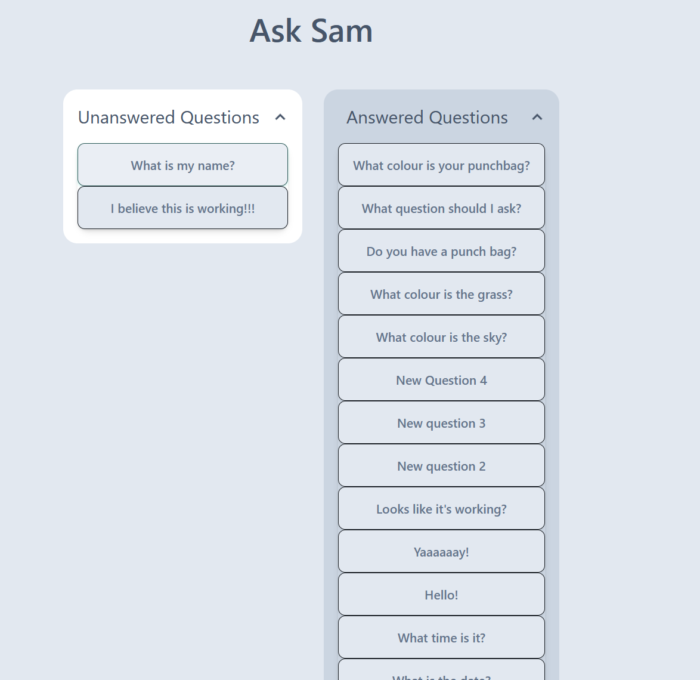
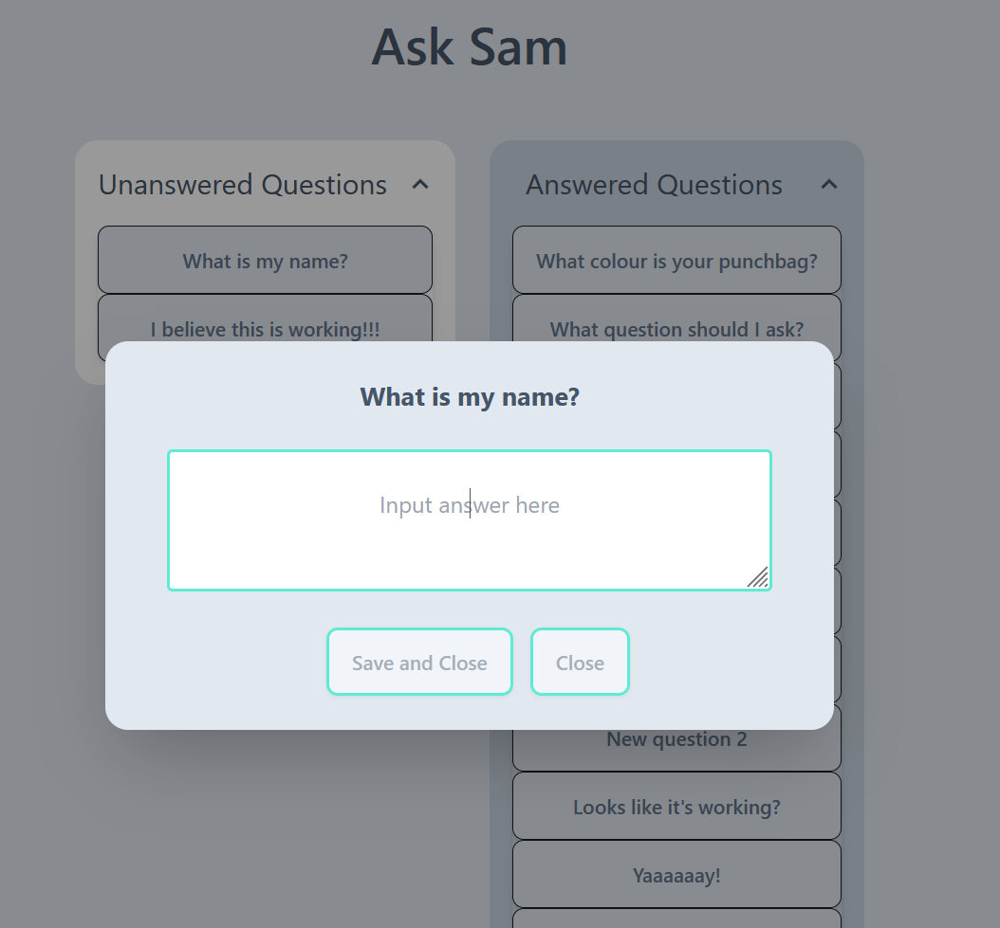
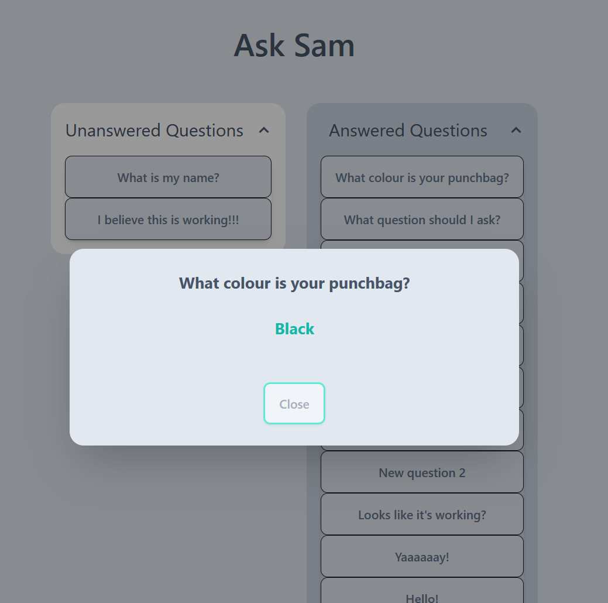

# Ask Sam (Staff)

## Default view

## Answering view

## Answered view

This front end app allows staff to answer the anonymous questions asked using AskSam_Client, and answer them with the objective to teach and help cultivate new perspectives on many things in life.

Technical flow of app

    Staff Loads the page
      React Sends GET request to server to receive all questions
      React populates two collapsable lists (based upon if the "answered" field is true or false)
        Answered Questions (Collapsed)
        Unanswered Questions (Uncollapsed)
    
    User clicks on question in Unanswered question
      React displays a modal with the question on the top half and empty answer field and "Save" button on the bottom
      When user populates answer and clicks save
        React sends PUT request with question and answer to DB